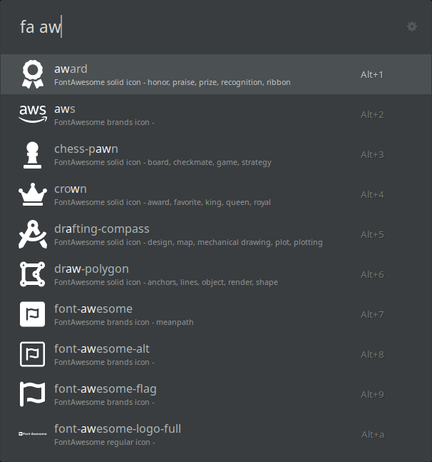

# Font Awesome Icons Search for Ulauncher

A powerful Ulauncher extension that provides instant access to the entire Font Awesome icon library, allowing you to search, preview, and copy icon code directly to your clipboard with minimal effort.



## Features

- **Comprehensive Search**: Find icons by name and categories.
- **Lightning-Fast Results**: Optimized search with caching for instant responses.
- **Visual Preview**: See high-quality SVG previews directly in search results.
- **Multiple Formats**: Copy icons as HTML, CSS classes, Unicode characters, or SVG code.
- **Smart Sorting**: Most relevant matches appear first with intelligent ranking.
- **Style Variants**: Access all Font Awesome styles (solid, regular, and brands).
- **Search Terms**: View related keywords to discover similar icons.
- **Syncronize Icons**: Includes the helper script to synchronize the font awesome icons so that you always have the update collection of icons.

## Installation

The extension is available in the Ulauncher extensions store:

1. Open Ulauncher preferences (`Ctrl+Space` and click the cog icon).
2. Select the "Extensions" tab.
3. Click "Add Extension".
4. Use `https://github.com/lazypolymath/ulauncher-fontawesome` as the extension URL.
5. Click "Add" to install.

## Usage

1. Activate Ulauncher with your shortcut (default: `Ctrl+Space`)
2. Type the keyword `fa` (or your custom keyword) followed by a space
3. Enter your search term (e.g., "chart", "user", "arrow")
4. Browse through the matching icons using arrow keys
5. Press Enter on any icon to copy its code to your clipboard
6. Paste directly into your code editor or document

## Synchronizing Font Awesome Icons

To get the latest Font Awesome icons, simply run the `setup.sh` python script from the extension's root directory:

```bash
# Navigate to the extension directory.
cd ~/.local/share/ulauncher/extensions/ulauncher-fontawesome
# Make the script executable if you haven't already.
chmod +x setup.sh
# Download the icons.
./setup.sh
```

### Search Tips & Tricks

- **General searches**: `fa chart`, `fa user`, `fa file`
- **Style-specific**: `fa brands github`, `fa regular bell`
- **Category searching**: `fa navigation`, `fa medical`, `fa weather`
- **Descriptive terms**: `fa spinner`, `fa alert`, `fa success`
- **Functional needs**: `fa upload`, `fa delete`, `fa settings`
- **Emotional icons**: `fa happy`, `fa sad`, `fa angry`

## Configuration Options

Configure the extension through Ulauncher's preferences:

| Setting | Description | Default |
|---------|-------------|---------|
| **Keyword** | Trigger command for extension | `fa` |
| **Copy Format** | Output format (HTML, class, unicode, SVG) | `html` |
| **Icon Color** | Preview icon color (hex) | `7dcfff` |

## Copy Format Options

The extension supports multiple output formats:

- **HTML** - `<i class="fas fa-star"></i>`
- **Class** - `fas fa-star`
- **Unicode** - `&#f005;` (Unicode character reference)
- **SVG** - Full SVG markup for pixel-perfect scaling

## Development

Want to customize or extend this extension?

- Fork the repository at [GitHub](https://github.com/lazypolymath/ulauncher-fontawesome)
- The main implementation is in `main.py`
- Icon metadata is stored in `data/fontawesome.json`
- SVG icons are in the `images/icons/` directory
- Submit pull requests for new features or improvements!

## License

[MIT License](LICENSE)